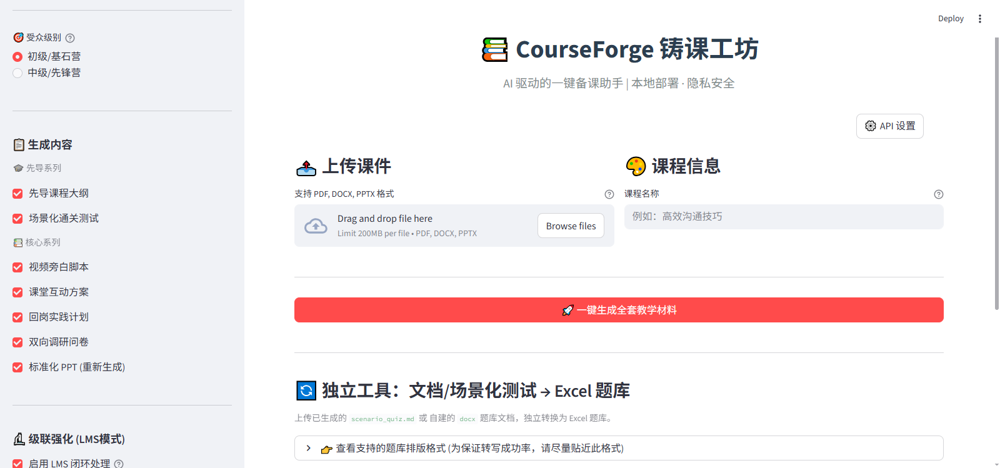

# 🚀 CourseForge (铸课工坊)

🌍 *[English Version](#english-version)* | 🇨🇳 *[中文版](#中文版)*

---

# 🇨🇳 CourseForge (中文版)

> **将专业的企业业务知识，一键转化为高质量、可落地的标准化培训课程。**

CourseForge 是一个专为企业内训师、业务专家设计的 **AI 赋能教案生成系统**。它能够深度解析枯燥的文档（PDF、Word、PPT），并通过内置的资深课程设计师 Prompt 架构，将晦涩难懂的业务制度一键转化为生动、专业的系统化培训材料。

## 📸 界面预览 (Interface Showcase)
*(请将您的实际截图命名为 `ui_main.png` 并放置在 `assets/` 文件夹下)*

*图：CourseForge 核心工作台 - 支持一键生成多模态教案*

## ⚡ 快速开始 (免安装开箱即用)
对于不想配置代码环境的业务用户，我们提供了打包好的独立运行版本：
1. 前往 GitHub 的 **[Releases 发布页](https://github.com/DaddyTools2025/CourseForge/releases/latest)**。
2. 下载最新版本的压缩包（如 `CourseForge-Windows-v1.0.zip`）。
3. 解压到任意目录，双击运行 `CourseForge.exe` 即可直接在浏览器中使用！

## ✨ 核心特性

### 1. 🎯 多模态课件拆解与知识重组
- **无损提取**：支持 `PDF`、`DOCX`、`PPTX`，自动过滤页眉页脚。
- **知识点映射**：精准识别文档层级，映射为教学目标（基于 Bloom 认知分类法）。
- **全方位输出**：一键生成「视频旁白脚本」、「先导微课大纲」、「课堂互动方案」、「回岗实践计划」和「双向调研问卷」。

### 2. 🔌 LMS 系统无缝对接
- **场景化通关测试**：基于上下文智能生成带时间、地点、人物的真实业务场景题。
- **动态配额出题**：严格遵循内部考试系统标准，按知识点结构输出（单选、多选、判断、填空）。
- **JSON / Excel 导出**：自动打包生成结构化数据，无缝导入主流学习管理系统 (LMS)。

### 3. 🏢 动态行业场景适配
内置 **“行业场景”** 快速切换：
- **银行业**：聚焦柜面操作、信贷合规、风险研判。
- **互联网**：偏向系统架构、产品迭代、敏捷冲刺。
- **通用企业**：聚焦跨部门协作、管理决策与标准作业流程。

### 4. 🔒 内/外网双模安全架构
- **外网模式**：对接 Google Gemini / Anthropic Claude 等商业大模型。
- **内网模式 (Enterprise Ready)**：支持纯本地网络调用，对接企业内部私有化 API，数据不出域。

## 🛠️ 源码安装与二次开发
1. 克隆项目并进入目录：`git clone https://github.com/DaddyTools2025/CourseForge.git`
2. 创建虚拟环境：`python -m venv venv`
3. 安装依赖：`pip install -r requirements.txt`
4. 启动应用：`streamlit run app.py`

---

  

# 🌍 CourseForge (English Version)

> **Transform professional enterprise business knowledge into high-quality, actionable, and standardized training courses with one click.**

CourseForge is an **AI-empowered course generation system** designed for corporate trainers and business experts. It deeply analyzes dry documents (PDF, Word, PPT) and, through a built-in senior instructional designer Prompt architecture, transforms obscure business rules into vivid and professional systematic training materials.

## 📸 Interface Showcase
*(Please place your actual screenshot named `ui_main.png` in the `assets/` folder)*

*Fig: CourseForge Core Workspace - One-click multi-modal lesson plan generation*

## ⚡ Quick Start (Out-of-the-box, No Installation)
For business users who don't want to set up a coding environment, we provide a standalone executable version:
1. Go to the **[Releases Page](https://github.com/DaddyTools2025/CourseForge/releases/latest)** of this repository.
2. Download the latest compressed package (e.g., `CourseForge-Windows-v1.0.zip`).
3. Extract it to any directory and double-click `CourseForge.exe` to use it directly in your browser!

## ✨ Core Features

### 1. 🎯 Multi-modal Deconstruction & Knowledge Restructuring
- **Lossless Extraction**: Supports `PDF`, `DOCX`, `PPTX`, automatically filtering headers and footers.
- **Knowledge Mapping**: Accurately identifies document hierarchies and maps them to teaching objectives (based on Bloom's Taxonomy).
- **Comprehensive Output**: Generates "Video Voiceover Scripts", "Micro-course Outlines", "Classroom Interaction Plans", "Post-training Action Plans", and "Two-way Survey Questionnaires" with one click.

### 2. 🔌 Seamless LMS Integration
- **Scenario-based Tests**: Intelligently generates real business scenario questions with time, location, and characters based on context.
- **Dynamic Quota Questioning**: Strictly follows internal exam system standards, outputting structurally (Single Choice, Multiple Choice, True/False, Fill-in-the-blanks).
- **JSON / Excel Export**: Automatically packages structural data for seamless import into mainstream Learning Management Systems (LMS).

### 3. 🏢 Dynamic Industry Profile Adaptation
Built-in **"Industry Scenario"** quick switch:
- **Banking**: Focuses on counter operations, credit compliance, and risk assessment.
- **Internet/Tech**: Leans towards system architecture, product iteration, and agile sprints.
- **General Enterprise**: Focuses on cross-departmental collaboration, management decisions, and SOPs.

### 4. 🔒 Dual-Mode Security Architecture (Internal/External)
- **External Mode**: Connects to commercial LLMs like Google Gemini / Anthropic Claude.
- **Internal Mode (Enterprise Ready)**: Supports pure local network calls, connecting to enterprise internal private APIs. Data never leaves the domain.

## 🛠️ Source Installation & Development
1. Clone the repo: `git clone https://github.com/DaddyTools2025/CourseForge.git`
2. Create venv: `python -m venv venv`
3. Install dependencies: `pip install -r requirements.txt`
4. Run the app: `streamlit run app.py`

---
## 📄 License
[MIT License](LICENSE)
